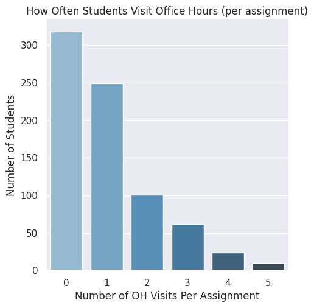
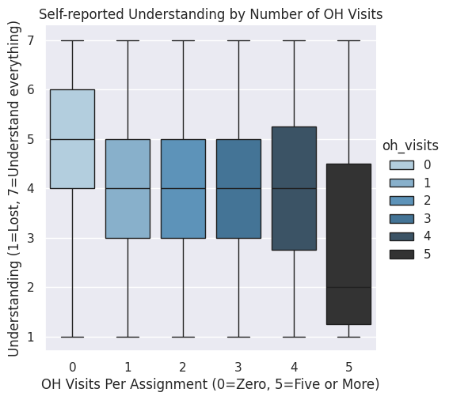
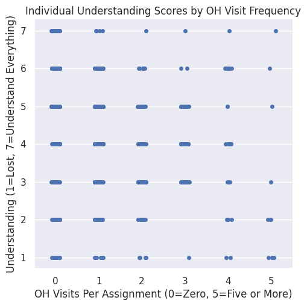

Summary 
We analyzed survey data from COMP110. We wanted to see if visiting office hours is associated with higher self reported understanded 

Analysis 
We looked at how often students visited office hours and compared that to their self-reported understanding level, filtering out incomplete responses

Conclusion
The data was inconclusive; students who visited once or twice showed slightly higher understanding, but even people who went a lot were still confused
